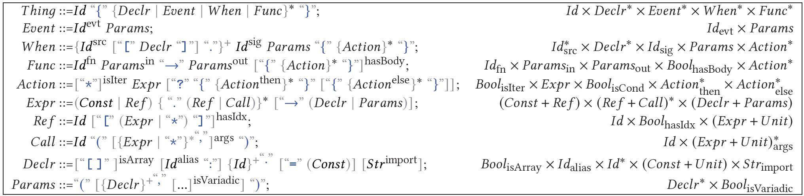

# Research Seminar: **Topics in Software Engineering**

## Research Seminar: **Topics in Software Engineering**
__Step 0__: We're given a context-free grammar specification in BNF metasyntax notation:


#
___Step 1___: We use [Kogi](https://zenodo.org/record/4033220) to derive block-based environments (BBE) from given BNF notation.

Kogi uses [Google Blockly](https://developers.google.com/blockly) to create the UI and [Rascal](https://www.rascal-mpl.org/) for the definition of grammars.

See *Syntax.rsc* for Formula definition and *generated-kogi-files/index.html* & *generated-kogi-files/blocks.js* for generated Blockly code by Kogi.

#
___Step 2___: after generating Blockly BBE, we manually updated the generated files (see folder *modified-kogi-files*/**) to better fit our specific use case.

### *Main changes*
- Created Syntax.rsc according to *BNF.png*
- Added Generate XML DOM functionality and displaying it in a modal
- Added Blockly GRID layout
- Added Blockly zoon and focus buttons
- Reorganized and recolored block categories for better readability
- Added labels under each block category in the toolbox 
- Added tooltips for each block in the toolbox and canvas
- Added hat on Thing block to indicate starting block
- Generating formula code on execution pane from Blockly's Canvas in real time
#
## Incountered Issues and limitations

- Difficulty using Kogi because of lack of documentation
- [Kogi](https://github.com/cwi-swat/kogi) master branch doesn't work, only other branches appears to successfully generate Blockly code. 
    - we're using the branch [bscproject_jchin](https://github.com/cwi-swat/kogi/tree/bscproject_jchin)
- Kogi block categories order is random and not accroding to the order defined in *Syntax.rsc*
- Editing labels, tooltips and so on is done via changing the generated fiels and not the rascal file, so changes are lost upon re-generation
- Had to manually add shadow blocks
- hosting different categories under one block (such as *Thing* block) requires a wrapper (such as *Thing_parameters*)

#
## Running Kogi code generation
- Using [VS code](https://code.visualstudio.com/) IDE, add [Rascal Metaprogramming Language](https://marketplace.visualstudio.com/items?itemName=UseTheSource.rascalmpl) Extention
- Clone the  branch [bscproject_jchin](https://github.com/cwi-swat/kogi/tree/bscproject_jchin)
```js
git clone https://github.com/cwi-swat/kogi/tree/bscproject_jchin
```

- copy this repository files to a new folder named "seminar" under /src/kogi/
- Viewing *Syntax.rsc*, press the extention button "import in new Rascal Terminal" which will open a Rascal terminal. type the following commands:
```js
import kogi::seminar::Syntax;
import kogi::Compile;
createBlocklyApp(#Thing, targetPath=|project://kogi/src/kogi/seminar/generated-kogi-files|);
```
- Kogi generated files *index.html & blocks.js* are under *generated-kogi-files/**
- Our modified Kogi files are under *modified-kogi-files/**